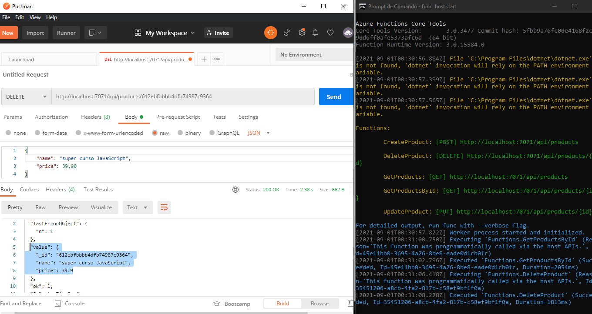

# Construindo sexy APIs usando arquitetura serverless

Construindo uma API para Gestão de Produtos utilizando Node.js, aplicando conceitos de Arquitetura Serverless com Node.js. [^1]

< br/>

Ferramentas:

- Azure Function Core Tools

Dependências:

- mongodb

 

### Rota de entrada para o serviço na nuvem Azure da Microsof:

 

### Resultado da requisição na rota GET 'products', com o retorno feito pelo serviço da Azure e do banco de dados MongoDB:

 

### Resultado da requisição na rota GET 'products/{id}', sendo retornada pelo serviço da Azure e do banco de dados MongoDB:

 

### Resultado da requisição na rota POST 'products' sendo retornada pelo serviço da Azure e da inserção do novo documento no banco de dados MongoDB:

 

### Resultado da requisição na rota PUT 'products', com o retorno pelo serviço da Azure, junto com a atualização do documento no banco de dados MongoDB:

 

### Resultado da requisição na rota DELETE 'products':

[^1] Orientação do professor Igor Halfeld da Digital Innovation One.

